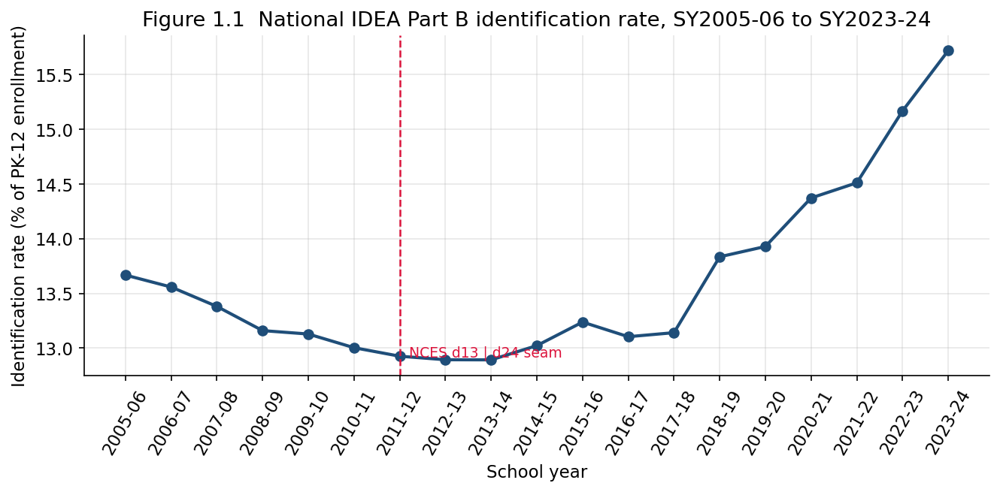
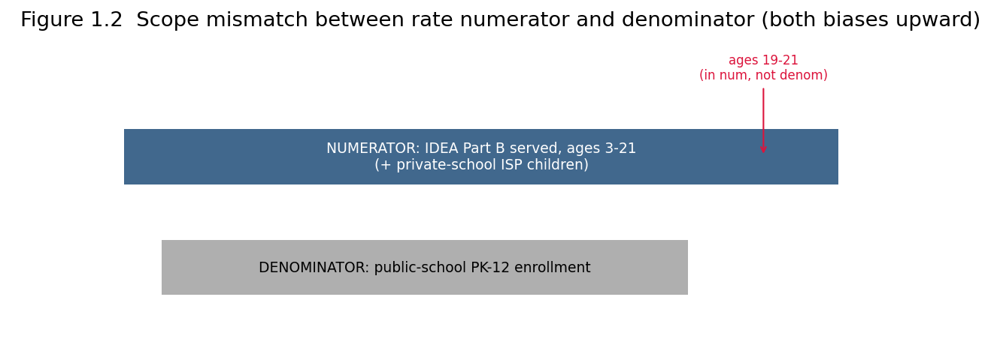
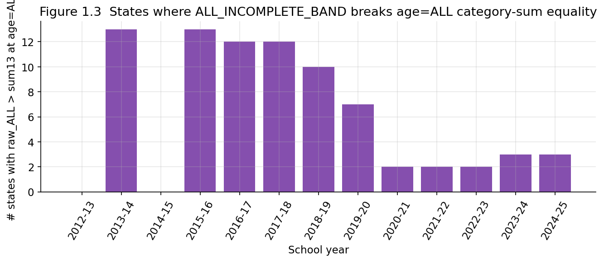

# Chapter 1 — The Data and Its Measurement Limits

## 1.1 Purpose and scope

This study is a descriptive analysis of two decades of special-education
identification in the United States. To carry it out we assembled a
20-year state-level panel of special-education child counts: for the 50
states and the District of Columbia, the number of children served under
Part B of the Individuals with Disabilities Education Act (IDEA) by federal
disability category, school year by school year, from SY2005-06 through
SY2024-25. To these counts we joined a public-school enrollment denominator
from the National Center for Education Statistics (NCES), which yields the
study's central derived metric: the **identification rate**, the share of
enrolled children formally identified for IDEA Part B services.

The chapters that follow examine the national identification trend, the
shifting composition of disability categories, the rapid growth of the
autism category, the dispersion of identification rates across states, the
trajectory of placement in the least restrictive environment (LRE), and
the structural break introduced by the COVID-19 pandemic. This first
chapter does none of that analysis. Its job is to make the rest
trustworthy: to state precisely what the data are, how we assembled them,
and — most importantly — what they cannot support. A descriptive analysis
is only as honest as its account of its own measurement threats, and these
data carry several that are large enough to overturn a naive reading of any
single chart.

## 1.2 Assembling the data

We compiled the panel into a single relational dataset that separates
measured facts from documentation: two fact tables hold the counts,
dimension tables hold the category/jurisdiction/year keys, and a set of
metadata tables record provenance, column definitions, the metric
definition, and a data-quality ledger. A third fact table and an
associated view hold the educational-environment (LRE) breakdown for
school-age students, added once we extended the scope to placement.

The temporal coverage is deliberately asymmetric across the three fact
tables, and the asymmetry is not an error. Table 1.1 records it exactly as
the assembled data stand.

**Table 1.1 — Temporal coverage of the fact tables and derived rate**

| Object | First year | Last year | Years | Rows |
|---|---|---|---|---|
| `fact_state_disability` (counts) | SY2005-06 | SY2024-25 | 20 | 42,840 |
| `fact_state_enrollment` (denominator) | SY2005-06 | SY2023-24 | 19 | 969 |
| `fact_state_environment` (LRE, school-age) | SY2012-13 | SY2024-25 | 13 | 83,538 |
| `v_identification_rate` (computable) | SY2005-06 | SY2023-24 | 19 | — |

Three consequences follow immediately and constrain every later chapter:

1. **The disability counts run one year longer than the enrollment
   denominator.** SY2024-25 has counts but no rate, because the matching
   NCES enrollment edition was not yet published at build time. Any chart
   of the identification *rate* therefore ends at SY2023-24 (19 points);
   only charts of raw *counts* extend to SY2024-25 (20 points).

2. **The LRE table begins only in SY2012-13.** Before that school year,
   the OSEP source files did not carry an environment dimension. The LRE
   chapter is a 13-year series, not a 20-year one, and cannot be spliced
   to the earlier period.

3. **The environment table covers school-age (6–21) students only.** The
   early-childhood (3–5) placement taxonomy is a different, non-comparable
   classification, so no unified inclusion metric spans both age bands.

## 1.3 Sources and the seam in the denominator

The numerator and the denominator come from different agencies with
different publication cycles, and one of those cycles introduces a
structural seam that is easy to misread as a real trend.

The **numerator** is the OSEP §618 Part B Child Count, downloaded as raw
CSV files, one per school year, from `data.ed.gov`. These are
authoritative federal administrative counts.

The **denominator** is NCES Digest Table 203.20, "Enrollment in public
elementary and secondary schools." No single Digest edition covers the
full 19-year window, so two editions are stitched together: Digest 2013
(d13) supplies SY2005-06 through SY2010-11, and Digest 2024 (d24) supplies
SY2011-12 through SY2023-24. NCES revises historical figures between
editions, so the **change of edition at SY2011-12 is a vintage seam**: a
small discontinuity in the rate around that year may reflect an NCES
revision rather than any change in identification behavior. Figure 1.1
marks this seam explicitly, and the trend chapter must treat the
pre-/post-seam comparison with corresponding caution.

All source files are public federal data, downloaded and SHA-256-verified
on 2026-05-29. Table 1.2 lists the source datasets; the complete list of
20 OSEP per-year file URLs with their individual SHA-256 hashes is in the
accompanying `sources_manifest.json`.

**Table 1.2 — Source datasets assembled for this study**

| Role | Source | Coverage | Landing page / file URL |
|---|---|---|---|
| Numerator (pre-2012) | OSEP §618 Part B Child Count (7 files, SY2005-06 → SY2011-12) | counts only, no environments | <https://data.ed.gov/dataset/idea-section-618-state-level-data-files-part-b-child-count> |
| Numerator (post-2012) | OSEP §618 Part B Child Count and Educational Environments (13 files, SY2012-13 → SY2024-25) | counts + LRE environments | <https://data.ed.gov/dataset/idea-section-618-state-part-b-child-count-and-educational-environments> |
| Denominator (d13) | NCES Digest 2013, Table 203.20 (PK-12 enrollment) | SY2005-06 → SY2010-11 | <https://nces.ed.gov/programs/digest/d13/tables/xls/tabn203.20.xls> |
| Denominator (d24) | NCES Digest 2024, Table 203.20 (PK-12 enrollment) | SY2011-12 → SY2023-24 | <https://nces.ed.gov/programs/digest/d24/tables/xls/tabn203.20.xlsx> |

The OSEP files are accessed programmatically through the `data.ed.gov`
CKAN API; the two dataset UUIDs are
`207550d8-e977-448a-bf44-15e35104b9d1` (pre-2012) and
`71ca7d0c-a161-4abe-9e2b-4e68ffb1061a` (post-2012). The SY2024-25
enrollment denominator is not yet available: NCES Digest 2025 (d25), which
will carry it, was unpublished at build time, which is why the
identification rate stops at SY2023-24 (§1.2).

*Figure 1.1.* The national identification rate traces a shallow U: it
declines from about 13.7% in SY2005-06 to roughly 12.9% around
SY2011-12–SY2013-14, then rises to about 15.7% by SY2023-24. The dashed
line marks the NCES edition seam. The bottom of the U coincides with the
seam, which is exactly why the apparent inflection cannot be attributed to
real-world identification dynamics on the strength of this dataset alone.

## 1.4 The one defined metric and its built-in biases

The database defines exactly one metric. Composition shares (e.g., SLD as
a fraction of all served children) are treated as descriptive arithmetic,
not as defined metrics, because they carry no documented denominator
asymmetry. The identification rate does carry such asymmetries, so it is
formalized in the metadata.

For a school year $t$ and jurisdiction $s$, let $N_{s,t}$ be the count of
children served under IDEA Part B in the synthesized cell
(`disability_code = ALL`, `age_band = ALL`), and let $E_{s,t}$ be the
public-school PK–12 fall enrollment. The state-level identification rate
is

$$
r_{s,t} \;=\; 100 \times \frac{N_{s,t}}{E_{s,t}} \qquad (\%),
$$

and the national rate aggregates before dividing,

$$
R_{t} \;=\; 100 \times \frac{\sum_{s} N_{s,t}}{\sum_{s} E_{s,t}}.
$$

Aggregating the counts before dividing — rather than averaging the 51
state rates — is the correct national figure, because it weights each
jurisdiction by its enrollment.

The metric is recorded with two asymmetries, and they do **not** cancel.
The numerator $N_{s,t}$ counts children aged 3–21, including 19–21-year-olds
in IDEA transition services who are largely absent from a PK–12
denominator; it also includes parentally-placed private-school children
receiving services under an individualized services plan (IDEA §300.132),
whereas the denominator counts public-school enrollment only. Both
mismatches push the same direction:

$$
r_{s,t} \;=\; \underbrace{r^{\ast}_{s,t}}_{\text{true PK-12 share}} \;+\; \underbrace{\delta^{\text{(19-21)}}_{s,t}}_{\ge 0} \;+\; \underbrace{\delta^{\text{(ISP)}}_{s,t}}_{\ge 0},
$$

so the published rate is an **upward-biased** estimate of the true
PK–12 identification share. The two bias terms are not separately bounded
in this build; the rate should be read as a slight overestimate, and —
critically for the cross-state chapter — the bias terms vary by state
(states differ in transition-age caseloads and private-school ISP
practice), so the bias does not net out of a state-to-state comparison.
Figure 1.2 shows the mismatch schematically.

## 1.5 How the ALL cell is built, and where the category sum stops adding up

The rate depends on a single synthesized cell per (state, year): the count
for `disability_code = ALL` at `age_band = ALL`. The loader builds the
`ALL` cells through one canonical procedure, and one feature of that
procedure has a consequence the analyst must internalize before reading
any composition chart.

Within a single age band, the data reconcile exactly. For every post-2012
(state, year) — excluding Iowa from SY2019-20 onward, which reports only a
noncategorical `ALL`, and the Arizona MD anomaly in SY2024-25, which is
imputed — the sum over the 13 federal categories equals the reported "All
Disabilities" figure **for that band**:

$$
\sum_{c \,\in\, 13\text{ cats}} n_{s,t,c,b} \;=\; n_{s,t,\text{ALL},b}, \qquad b \in \{\text{3-5},\ \text{6-21}\}.
$$

This held with **zero violations** across the post-2012 panel. But the
equality does **not** carry up to `age_band = ALL`. When a category's
component band is suppressed or unreported (a NULL), the synthesized
age-`ALL` cell for that category is also set to NULL and flagged
`ALL_INCOMPLETE_BAND`, rather than being filled with a partial sum that
would understate the total. That category then drops out of the
category-summed total, while the independently read
(`ALL`, `ALL`) cell still reflects the full population. The result is a
one-sided inequality at the aggregate level:

$$
n_{s,t,\text{ALL},\text{ALL}} \;\ge\; \sum_{c \,\in\, 13\text{ cats}} n_{s,t,c,\text{ALL}},
$$

with strict inequality wherever any category carries an incomplete band.
This occurs **every year in the post-2012 data**, in 2–13 states per year
(Arkansas, New Jersey, New York, Florida, and Connecticut recur). It is
not confined to the pre-2012 files. Figure 1.3 counts the affected states
by year.

The practical rule for later chapters: **compute category composition
within a fixed age band, never at `age_band = ALL`.** Summing the 13
categories at the all-ages level silently omits the children in
incomplete-band categories and produces shares that do not sum to the
reported total. We adopted this as a data-construction rule — the
13-category equality is enforced only per band, and the all-ages level
satisfies only the weaker inequality above (§1.7).

## 1.6 The data-quality ledger as actually assembled

In assembling the data we initially scoped a longer list of 18 potential
data-quality issues (a Texas administrative cap, Wisconsin suppression,
COVID notes, imputed prekindergarten enrollment, and others). The assembled
dataset, however, carries a **smaller** machine-readable ledger — 11 rows
under three issue codes — and a reader should not assume the full
contemplated list is encoded in the data. Table 1.3 shows what the
data-quality table actually contains.

**Table 1.3 — Data-quality rows actually encoded in the dataset**

| issue_code | severity | rows | scope |
|---|---|---|---|
| `NONCATEGORICAL` | info | 6 | IA (SY2019-20 → SY2024-25) |
| `AGE_BAND_SUPPRESSED` | warn | 4 | WY, ME, VT, LA |
| `ANOMALY_IMPUTED` | block | 1 | AZ (SY2024-25) |
| `REPORTING_VS_STATUTORY` | info | 1 | dataset-wide (HI/DD vs 34 CFR §300.8) |

The gap between the contemplated issues and the encoded ledger matters
concretely. Several phenomena that later chapters might naturally discuss —
the Texas identification cap, the Wisconsin rate suppression, the COVID
reporting note, NCES prekindergarten imputation — are **not** encoded as
data-quality rows. Where a chapter relies on any of them, it must cite an
external source, because the data do not carry the caveat internally. Two
examples illustrate the asymmetry between what the *data values* encode and
what the *ledger* records:

- **Wisconsin's identification rate is genuinely NULL for SY2016-17
  through SY2019-20** — the suppression is reflected in the values — yet
  no ledger row explains *why*. The explanation must come from the NCES
  documentation.

- **Texas's pre-2018 identification rate is conspicuously low** (about
  8.7% in SY2012-13, rising past 12% by SY2022-23), consistent with the
  well-documented state enrollment cap on special-education
  identification. But with no Texas-cap row in the ledger, attributing the
  low rate to the cap is an external-evidence claim, not something the data
  certify.

Two further encoded behaviors should be carried forward as standing
caveats even though they sit under broad codes:

- **The school-age age-5 reclassification (FFY 2020).** From SY2020-21,
  OSEP moved school-age five-year-olds out of the 3–5 band into a new
  "Age 5 (School Age)-21" column. The 6–21 series therefore has a
  definitional break at SY2020-21, with SY2019-20 transitional. Any
  age-band trend must control for this seam.

- **The Arizona MD imputation (SY2024-25).** Arizona's Multiple
  Disabilities count in SY2024-25 is a prior-year carry-forward
  imputation, not a measured value. It must not be read as observed in the
  final-year composition.

- **Reporting categories, not statutory categories.** The 13 categories are
  OSEP Section 618 *reporting* categories, which do not coincide with the
  IDEA *statutory* eligibility categories (34 CFR §300.8). Two mismatches
  matter for analysis. The statute defines Deafness and Hearing impairment
  separately, but Section 618 has no standalone Deafness field — deaf
  students are reported within the single HI count (a full audit of all 20
  source files found zero standalone Deafness occurrences, all states, all
  years). And Developmental delay (DD) is reported as a distinct line item
  even though it is a noncategorical, state-discretionary classification for
  ages 3–9, not a statutory category. Work requiring deaf/hard-of-hearing
  disaggregation, or strict alignment to 34 CFR §300.8, should treat the
  Section 618 reporting frame as operative. This is recorded in the data
  themselves (`dim_disability.notes` on HI and DD; a `REPORTING_VS_STATUTORY`
  row in the data-quality ledger).

## 1.7 A data-construction decision worth recording

One decision in assembling the data is worth stating explicitly because it
governs §1.5 and every composition figure that follows. A natural
expectation is that the 13 category counts sum exactly to the reported "All
Disabilities" total for every post-2012 (state, year). That exact equality
holds only **per age band**; at `age_band = ALL` the rule we adopted for
incomplete bands — if a category's component band is missing, its all-ages
cell is left NULL rather than partially summed — produces a one-sided
inequality in 2–13 states every year. We therefore enforce the equality
only at the per-band level and hold the all-ages level to the weaker
invariant $n_{\text{ALL,ALL}} \ge \sum_{13}$, recording every state where
the strict inequality appears. We verified the assembled data against both
conditions (zero per-band violations, zero cases of
$n_{\text{ALL,ALL}} < \sum_{13}$).

## 1.8 Reading guide for the chapters that follow

The measurement limits established here translate into a short set of
rules the analytic chapters apply silently:

- Rate series end at SY2023-24; count series may extend to SY2024-25.
- The identification rate is an upward-biased estimate of the true PK–12
  share, and the bias varies by state.
- The NCES edition seam at SY2011-12 can mimic a trend inflection.
- Category composition is computed within a fixed age band, never at
  all-ages.
- The 6–21 series breaks definitionally at SY2020-21 (age-5
  reclassification).
- Caveats not present in `meta_dataquality` (Texas cap, Wisconsin
  suppression, COVID, PK imputation) require external citation.

Every figure and statistic in this chapter is reproduced by the
accompanying notebook, `chapter1_analysis.ipynb`, which reads only the
database file and writes the three figures referenced above.
