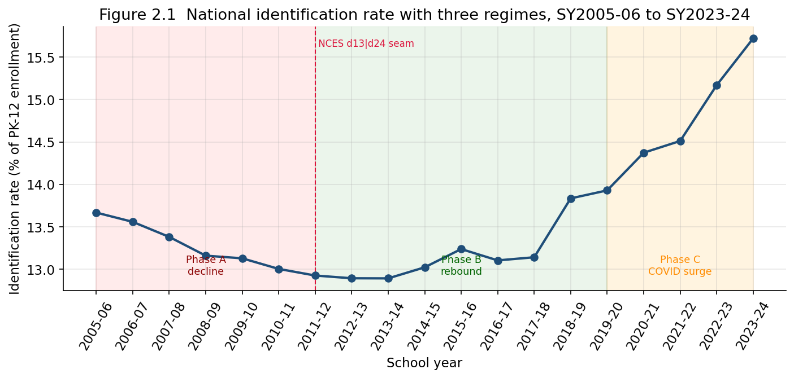
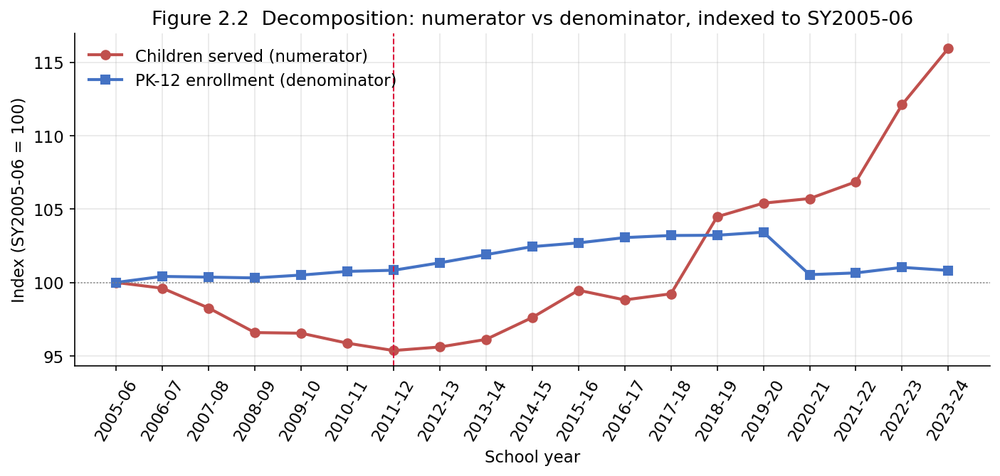

# Chapter 2 — The National Identification Trend, SY2005-06 to SY2023-24

## 2.1 The headline series

The single most cited number in special-education policy is the
identification rate: the share of public-school enrollment served under
IDEA Part B. Over the 19 years for which this database can compute it, that
national rate does not move monotonically. It traces a shallow **U**: a
decline through the late 2000s, a flat trough around SY2011-12–SY2013-14,
and a sustained climb thereafter that accelerates after SY2017-18.
Figure 2.1 shows the series with three regimes marked.

The rate falls from **13.67%** in SY2005-06 to a trough of **12.89%** in
SY2012-13–SY2013-14, then rises to **15.72%** by SY2023-24 — its highest
point in the window and, per NCES, an all-time high in the longer national
series. The official NCES summary describes the same upward movement over
its shorter SY2012-13 baseline, reporting served students rising from
6.4 million to 7.5 million between SY2012-13 and SY2022-23, "an increase
from 13 to 15 percent of students" ([NCES Fast Facts, Students with
Disabilities](https://nces.ed.gov/fastfacts/display.asp?id=64)).

Two cautions from Chapter 1 bound everything in this chapter. First, the
rate is an **upward-biased** estimate of the true PK–12 identification
share (ages 19–21 and private-school ISP children sit in the numerator but
not the denominator), so the *levels* should be read as slight
overstatements; the *changes over time* are the object of interest here.
Second, the NCES denominator changes edition at SY2011-12 — the dashed line
in Figure 2.1 — so the bottom of the U coincides with a data seam. Section
2.5 tests how much weight that seam can bear.

## 2.2 Decomposing the trend: numerator versus denominator

A rate can move because its numerator moves, because its denominator
moves, or both. Conflating these is the most common error in reading this
series, so before interpreting the U we separate the two components.
Writing the national rate as

$$
R_t = 100 \times \frac{S_t}{E_t},
$$

with $S_t$ the children served and $E_t$ the PK–12 enrollment, the
log-change decomposes additively:

$$
\Delta \ln R_t = \Delta \ln S_t - \Delta \ln E_t .
$$

A rise in $R_t$ is therefore **numerator-driven** when $\Delta \ln S_t >
\Delta \ln E_t$ and **denominator-driven** when enrollment falls faster
than the served population. Figure 2.2 indexes both series to SY2005-06 so
the two forces can be read directly.

The enrollment line (blue) is nearly flat across the whole window: PK–12
enrollment grew about 3% from SY2005-06 to its SY2019-20 peak, then fell
back. The served line (red) does almost all of the work — and it is the
red line, not the blue, that produces the U. Table 2.1 quantifies each
regime boundary.

**Table 2.1 — Phase decomposition (percent change in components, percentage-point change in rate)**

| Phase | Served (numerator) | Enrollment (denominator) | Rate |
|---|---|---|---|
| **A** decline, SY2005-06 → SY2011-12 | −4.64% | +0.83% | −0.74 pp |
| **B** rebound, SY2011-12 → SY2019-20 | +10.53% | +2.57% | +1.00 pp |
| COVID jump, SY2019-20 → SY2020-21 | +0.30% | −2.80% | +0.44 pp |
| **C** pandemic era, SY2019-20 → SY2023-24 | +10.01% | −2.51% | +1.79 pp |

The decomposition reads cleanly:

- **Phase A (decline)** is numerator-driven. The served population *fell*
  4.6% while enrollment was flat. The count of children served actually
  dropped — from about 6.71 million to 6.40 million — which independent
  reporting also noted for the post-2005 period ([Education Commission of
  the States, *A Look at Funding for Students with
  Disabilities*](https://www.ecs.org/clearinghouse/01/17/72/11772.pdf)).

- **Phase B (rebound)** is again numerator-driven, in the opposite
  direction: served grew 10.5% against 2.6% enrollment growth.

- **The COVID jump** is the diagnostic case and is *denominator-driven*.
  Between SY2019-20 and SY2020-21 the served population barely moved
  (+0.30%) while enrollment fell 2.80%. The rate rose 0.44 pp almost
  entirely because the denominator shrank, not because more children were
  identified. Section 2.4 returns to this.

## 2.3 Why the rate fell, then rose: the scholarly context

The U-shape is not merely a data curiosity; each arm has a literature.

**The Phase-A decline (mid-2000s).** Two structural changes coincide with
the falling count. First, the federal IDEA funding formula was revised
beginning SY2006-07 explicitly "to discourage the over-identification of
students with disabilities" ([ECS,
*Funding*](https://www.ecs.org/clearinghouse/01/17/72/11772.pdf)). Second,
the 2004 IDEA reauthorization permitted Response-to-Intervention (RTI)
approaches that route struggling students to general-education supports
before a special-education referral, which many researchers associate with
the contemporaneous decline in the largest category, specific learning
disabilities. The decline is concentrated in the historically dominant,
diagnostically "judgmental" categories — SLD, speech/language, emotional
disturbance, intellectual disability — a composition shift examined in
detail in Chapter 3.

**The Phase-B/C rise (2010s onward).** The renewed climb is driven by
growth in other-health-impairment (OHI, which captures ADHD) and autism,
even as SLD continues to shrink as a share. This substitution is the
subject of Chapter 3 and Chapter 4; here it suffices to note that the
*aggregate* rise masks offsetting category movements.

**The framing debate.** Whether a rising identification rate is "good"
(unmet need being met) or "bad" (over-identification) is contested, and the
contest is sharpest around race. The long-standing view that minority
students are *over*-identified — traceable to Dunn (1968) and dominant in
disproportionality policy — was challenged by Morgan, Farkas, and
colleagues, who argued from nationally representative, individual-level
data with controls for achievement and family socioeconomic status that
minority students are, if anything, *under*-identified relative to
comparable white students ([Morgan et al. 2017, *Educational Researcher*,
"Replicated Evidence of Racial and Ethnic Disparities"](https://journals.sagepub.com/doi/10.3102/0013189X17726282);
summarized in [Brookings,
2019](https://www.brookings.edu/articles/race-poverty-and-interpreting-overrepresentation-in-special-education/)).
The methodological core of the dispute — that descriptive,
district-aggregated counts and individual-level models with controls give
opposite signs — is itself a caution for this chapter: **this database is
aggregate and uncontrolled**, so it can describe the trend but cannot
adjudicate whether any level is "too high" or "too low." The
over-/under-identification question is examined further, by category, in
Chapter 5; the relevant point for the national trend is that the rate's
*direction* carries no automatic normative reading.

## 2.4 The pandemic inflection

The steepest part of the climb is post-2019, and it is partly an artifact
of how the rate is constructed. As Table 2.1 shows, the SY2019-20 →
SY2020-21 rate increase is overwhelmingly a denominator effect: public
enrollment dropped about 3% as families withdrew or delayed entry during
the pandemic, while the count of served children was essentially
unchanged. NCES documents both halves of this: total public enrollment
"decreased by 3 percent from fall 2019 to fall 2020," while the served
count "decreased by 1 percent between 2019–20 and 2020–21" — the first
decline in the served count in a decade — yet "the percentage of public
school students served under IDEA continued its upward trend"
([NCES Fast Facts](https://nces.ed.gov/fastfacts/display.asp?id=64); see
also [EdWeek, 2023](https://www.edweek.org/teaching-learning/the-number-of-students-in-special-education-has-doubled-in-the-past-45-years/2023/07)).

The interpretive rule follows directly: **a rate that rises because its
denominator shrank is not evidence of expanded identification.** From
SY2021-22 onward the numerator resumes real growth (Phase C served
+10.0% over SY2019-20), so the later climb is genuine; but the
SY2020-21 step specifically should not be read as a surge in
identification. This is exactly why Chapter 1 insisted on reporting the
numerator and denominator separately, and why this chapter leads with the
decomposition rather than the rate alone.

## 2.5 How much weight can the seam bear?

The bottom of the U sits at the NCES edition seam (d13 for
SY2005-06–SY2010-11, d24 from SY2011-12), which raises the worry that the
trough is a vintage artifact. We cannot re-derive the unpublished edition,
so we cannot fully rule this out. What we can check is whether the rate
change *across* the seam is anomalously large relative to adjacent
within-edition year-to-year changes. It is not:

$$
\Delta R_{\text{2010-11}\to\text{2011-12}} = -0.078\ \text{pp},
$$

which is smaller in magnitude than the within-edition changes immediately
around it (−0.22 pp, −0.12 pp in the preceding d13 years; −0.03 pp,
−0.001 pp in the following d24 years). The seam does **not** coincide with
an outsized jump. This is reassuring but not dispositive: a vintage
revision could in principle shift the *level* of the entire pre-2011
segment without creating a single-year spike. The honest statement is the
one Chapter 1 reached — the trough's *timing* relative to the seam means
its precise depth cannot be certified from this dataset, even though the
seam shows no sign of an artificial discontinuity. Any claim that
identification "bottomed out in 2012" should carry this caveat.

## 2.6 Summary

The national identification rate fell from 13.7% to a 12.9% trough by the
early 2010s and rose to 15.7% by SY2023-24. The fall and the rise are both
numerator-driven (the count of served children, not enrollment, moves the
rate), with two exceptions that the decomposition isolates: enrollment is
nearly flat throughout, and the single SY2020-21 step is a
denominator-shrinkage artifact of the pandemic rather than expanded
identification. The aggregate trend conceals offsetting category movements
(Chapters 3–4) and carries no built-in normative reading, since this
aggregate, uncontrolled series cannot adjudicate the over- versus
under-identification debate (Chapter 5). The U's trough coincides with the
NCES edition seam; the seam shows no anomalous jump, but the trough's exact
depth cannot be certified from this dataset.

Every figure and statistic is reproduced by `chapter2_analysis.ipynb`,
which reads only the assembled dataset and writes the two figures referenced
above.
