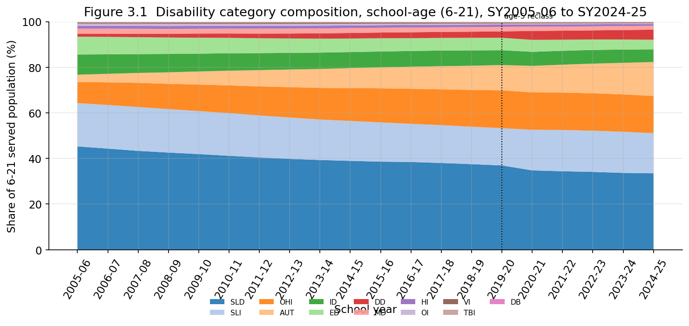
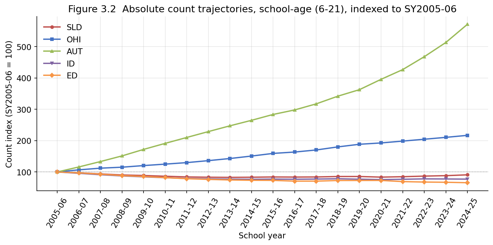
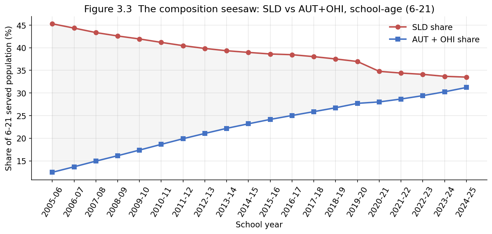

# Chapter 3 — The Recomposition of Disability Categories

## 3.1 A changing mix, not just a changing total

Chapter 2 showed that the aggregate identification rate fell and then rose.
That aggregate conceals a more interesting story: the *mix* of disability
categories served under IDEA Part B changed profoundly over the same two
decades. The single largest category shrank, two others grew rapidly, and
the historically dominant "judgmental" categories collectively gave way.
This chapter describes that recomposition and is careful to separate what
the data show (the shares moved) from what they cannot establish (why).

One methodological rule governs the entire chapter and is worth stating
before any number. Per Chapter 1 §1.5, **all composition figures here are
computed within the school-age band (ages 6–21), never at the all-ages
level.** At `age_band='ALL'` the `ALL_INCOMPLETE_BAND` NULL-propagation
rule drops categories with a suppressed component band out of the
category sum, so all-ages shares do not add up. Restricting to the 6–21
band — where the 13-category sum reconciles exactly to the band total —
removes that artifact. Iowa is excluded from SY2019-20 onward because it
reports only a noncategorical total.

## 3.2 The headline shift

Table 3.1 gives the school-age composition at three snapshots: the first
year, a midpoint, and the last year of counts.

**Table 3.1 — School-age (6–21) category shares (% of band total)**

| Category | SY2005-06 | SY2014-15 | SY2024-25 |
|---|---|---|---|
| SLD — Specific Learning Disability | 45.3 | 39.0 | 33.5 |
| SLI — Speech/Language Impairment | 19.0 | 17.5 | 17.6 |
| OHI — Other Health Impairment | 9.3 | 14.4 | 16.3 |
| AUT — Autism | 3.2 | 8.8 | 14.9 |
| ID — Intellectual Disability | 8.9 | 7.0 | 5.6 |
| ED — Emotional Disturbance | 7.8 | 5.9 | 4.2 |
| DD — Developmental Delay | 1.3 | 2.4 | 4.4 |
| MD — Multiple Disabilities | 2.2 | 2.1 | 1.7 |

The story is in four movements. SLD, which alone accounted for **45.3%** of
the school-age caseload in SY2005-06, fell to **33.5%** by SY2024-25 — a
loss of nearly 12 percentage points of share. Over the same window OHI rose
from 9.3% to 16.3% and AUT rose from 3.2% to **14.9%**, more than
quadrupling its share. ID and ED, the other two classically "judgmental"
categories, each declined by roughly a third in share. The result is a
caseload that in 2005 was dominated by a single category and by 2024 is
distributed across four large ones.

Figure 3.1 shows the full composition as a stacked area. The dotted line at
SY2019-20 marks the age-5 reclassification seam (§3.5), visible as a step
in the speech/language (SLI) and developmental-delay (DD) bands.

## 3.3 Shares versus counts: which categories actually shrank?

A falling *share* is not a falling *count*. A category can lose share
simply because others grow faster around it. Distinguishing the two is
essential, and it changes the interpretation of SLD in particular.
Figure 3.2 indexes the absolute school-age counts to SY2005-06.

Indexed to 100 in SY2005-06, the SY2024-25 counts are:

$$
\text{SLD} = 91, \quad \text{OHI} = 217, \quad \text{AUT} = 571, \quad \text{ID} = 77, \quad \text{ED} = 66.
$$

This reframes the headline. **SLD's count fell only about 9% across the
whole period** (and traced its own shallow U, bottoming in the early 2010s
before recovering). Most of SLD's 12-point *share* loss is therefore
**relative dilution** — SLD did not collapse; AUT and OHI grew around it.
ID and ED, by contrast, fell in *absolute* terms (counts down 23% and 34%
respectively), so their share losses are real contractions, not dilution.
AUT's growth is the opposite extreme: a 5.7-fold increase in count, the
fastest of any category, examined on its own in Chapter 4. OHI roughly
doubled. The lesson is that "SLD is down, autism is up" — a common
shorthand — conflates a dilution with a genuine surge.

## 3.4 The substitution narrative and its limits

The simultaneous fall of SLD/ID and rise of AUT/OHI is the empirical
pattern behind the **diagnostic substitution** hypothesis: that some
children who would once have been classified under one label are now
classified under another, so part of the autism rise reflects relabeling
rather than a true change in underlying prevalence. Figure 3.3 renders the
pattern as a seesaw — SLD's share against the combined AUT+OHI share. The
gap between them narrows from **32.8 points** in SY2005-06 to **2.3 points**
by SY2024-25; the two lines nearly converge but do not cross within the
window.

The hypothesis has genuine scholarly support. Shattuck (2006), analyzing
national IDEA child-count time series, found that rising autism prevalence
was significantly associated with corresponding declines in the use of
intellectual-disability and learning-disability classifications, and
argued the autism rise partly reflected diagnostic substitution rather
than a true epidemic ([Shattuck 2006, *Pediatrics*
117(4):1028](https://pubmed.ncbi.nlm.nih.gov/16585296/)).

But the hypothesis is contested precisely on the methodological ground that
these data share. Nelson and colleagues recomputed state-by-state ASD
and ID trends from IDEA data and found that the substitution story "appeared
more plausible when the data were aggregated across all states and ages"
but dissolved on disaggregation: the steep national ID decline was driven
mainly by about 15 states representing only a quarter of enrollment, while
in most states — including the most populous — ID did not fall as the
substitution account requires ([Nelson et al. 2017, *J. Autism Dev.
Disord.*](https://link.springer.com/article/10.1007/s10803-017-3187-0)).
A National Academies review similarly notes that special-education and
benefit-program counts are *administrative* categories shaped by service
eligibility and incentives, not clinical prevalence measures, so a decline
in one category and a rise in another need not imply the same children were
relabeled ([National Academies 2015, *Mental Disorders and Disabilities
Among Low-Income Children*, ch. 15](https://www.nationalacademies.org/read/21780/chapter/20)).

The implication for this study is direct and limiting. **These data
is state-aggregated and has no child-level identifiers, so it cannot track
any individual across categories and cannot test diagnostic substitution.**
The seesaw in Figure 3.3 is consistent with substitution, but it is equally
consistent with (a) a true rise in autism identification, (b) expanded
recognition and parental demand for the OHI/ADHD pathway, and (c) changes
in diagnostic criteria — most of which operate in the same period. The
data establish the *co-movement*; they cannot assign it a cause. The
state-level dispersion that Nelson et al. used to break the aggregate
pattern is available in our data and is examined in Chapter 5; even
there, the absence of child-level data bars a substitution test.

A note on what OHI captures: OHI is the federal category under which
ADHD is served, defined by limited "strength, vitality, or alertness" from
chronic or acute health conditions, ADHD explicitly among them ([34 CFR
§300.8(c)(10)]; see [Center for Parent Information and
Resources](https://www.parentcenterhub.org/adhd/)). Its near-doubling is
widely linked to rising ADHD diagnosis, medical recognition, and parental
demand for formal accommodations ([EdWeek
2023](https://www.edweek.org/teaching-learning/3-reasons-why-more-students-are-in-special-education/2023/10)),
and the category has been described in the legal literature as a "catchall"
for students who do not fit the more sharply defined classifications. None
of this is testable in the present data; it is context for the count
trajectory, not a claim derived from it.

## 3.5 Two measurement seams that masquerade as composition change

Two artifacts in the series can be mistaken for real recomposition, and
both must be read off the figures with care.

**The age-5 reclassification (SY2020-21).** From SY2020-21 OSEP moved
school-age five-year-olds out of the 3–5 band into the 6–21 band (Chapter 1
issue #15). Because five-year-olds are disproportionately served under
speech/language and developmental-delay labels, the SLI and DD shares
*jump* between SY2019-20 and SY2020-21 — SLI from 16.3% to 17.8%, DD from
2.8% to 3.9% — and SLD's share drops correspondingly as the band
denominator swells with younger children. These steps are a definitional
change in who is counted in the band, not a sudden change in identification
practice. The dotted line in Figures 3.1 and 3.3 marks the seam; any
SY2019-20 → SY2020-21 movement should be discounted accordingly.

**The "Mental Retardation" → "Intellectual Disability" relabeling.** The ID
category's federal label changed (Rosa's Law, 2010), but both labels were
normalized to a single `ID` code in assembly, so this is *not* a seam in
the data — ID is continuous across the rename. It is flagged here only
because readers familiar with the raw OSEP files might otherwise expect a
discontinuity where there is none.

**A reporting-frame caveat, not a seam.** Two of the categories used
throughout this chapter are OSEP Section 618 *reporting* categories that do
not align one-to-one with the IDEA *statutory* eligibility categories (34
CFR §300.8). The HI count subsumes deafness — Section 618 has no standalone
Deafness field, so deaf and hard-of-hearing students are not separable here
— and DD is reported as a distinct category despite being a noncategorical,
state-discretionary classification for ages 3–9. Neither affects the
composition *trends* in this chapter (both are stable reporting conventions
across all years), but any analysis mapping these categories to the
statutory taxonomy should consult the per-category notes recorded in the
dataset (Chapter 1 §1.6).

## 3.6 Summary

Between SY2005-06 and SY2024-25 the school-age IDEA caseload moved from
single-category dominance (SLD at 45%) toward a four-category distribution
(SLD 34%, SLI 18%, OHI 16%, AUT 15%). Separating shares from counts shows
that SLD's decline is mostly relative dilution (its count fell only ~9%),
ID and ED contracted in absolute terms (counts down ~23% and ~34%), and AUT
and OHI grew genuinely and fast (counts ×5.7 and ×2.2). The co-movement of
falling SLD/ID and rising AUT/OHI is consistent with diagnostic
substitution, a hypothesis with both support (Shattuck 2006) and
disaggregation-based rebuttal (Nelson et al. 2017); this state-aggregated,
child-anonymous dataset can document the co-movement but cannot test the
mechanism. Two seams — the SY2020-21 age-5 reclassification and the ID
relabeling — must be netted out before reading composition change, the
first because it shifts the band denominator and the second because the
database has already absorbed it.

Every figure and statistic is reproduced by `chapter3_analysis.ipynb`,
which reads only the assembled dataset and writes the three figures referenced
above.
