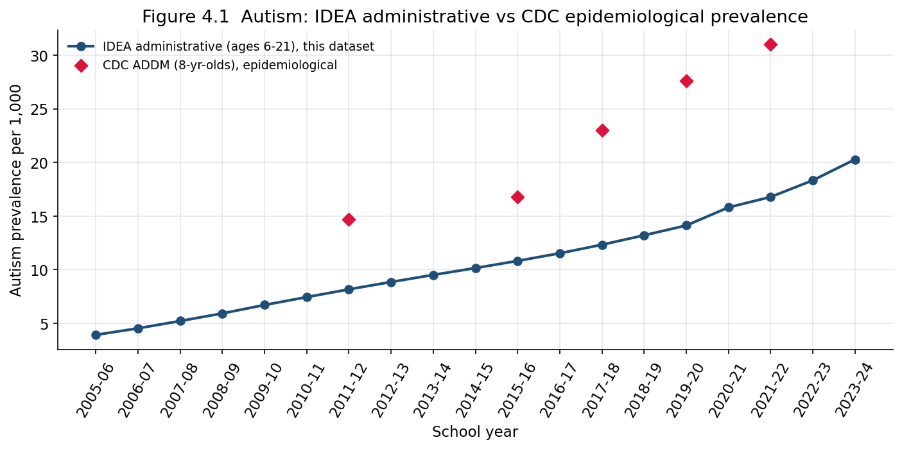
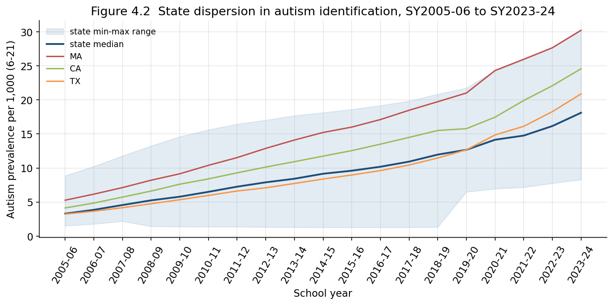
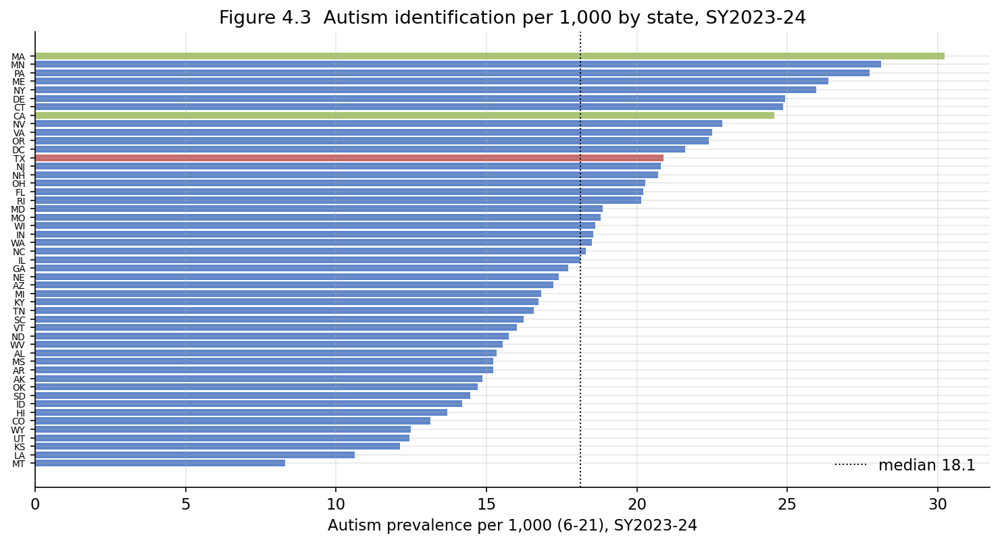

# Chapter 4 — Anatomy of the Autism Increase

## 4.1 The fastest-growing category, isolated

Chapter 3 separated relative dilution from genuine growth and found autism
(AUT) to be the extreme case: a school-age count that multiplied 5.7-fold
while every other large category grew modestly, contracted, or merely held.
This chapter takes autism on its own. The central question is not *whether*
the autism count rose — it plainly did — but *what kind of quantity* the
rise represents. The answer governs how the number may be used, and it is
the most consequential measurement question in the entire dataset, because
autism is also the category most often cited in public debate about an
"epidemic."

To remove enrollment growth as a confounder, autism is expressed throughout
as a **rate per 1,000 enrolled students** in the school-age (6–21) band,
rather than as a raw count or an all-disability share:

$$
\text{AUT}_{s,t} = 1000 \times \frac{n^{\text{AUT}}_{s,t}}{E_{s,t}} \quad \text{(per 1,000)}.
$$

## 4.2 A near-linear five-fold rise

Nationally, the IDEA school-age autism rate rose from **3.9 per 1,000** in
SY2005-06 to **20.3 per 1,000** in SY2023-24 — a **5.2-fold** increase, and
strikingly close to linear across the whole window with a mild acceleration
after SY2019-20. Figure 4.1 plots it.

The red diamonds are an external benchmark: the CDC's Autism and
Developmental Disabilities Monitoring (ADDM) Network estimates of autism
prevalence among 8-year-olds, which rose from 1 in 150 (6.7 per 1,000) in
2000 to 1 in 36 (27.6 per 1,000) in 2020 and about 1 in 31 in 2022
([CDC ADDM 2020, *MMWR*](https://www.cdc.gov/mmwr/volumes/74/ss/ss7402a1.htm);
[CDC press release,
2023](https://www.cdc.gov/media/releases/2023/p0323-autism.html)). Two
features of the comparison matter:

1. The IDEA administrative rate sits **consistently below** the CDC
   epidemiological estimate. This is expected and important. IDEA counts
   only children who are both identified *and* found to need special
   education; ADDM counts any 8-year-old meeting a case definition from
   medical *or* educational records. The gap is the population of children
   with autism who are not served under the autism category in special
   education (some are served under another category; some receive a 504
   plan or no service). Shattuck (2006) made exactly this point —
   "administrative prevalence figures for most states are well below
   epidemiological estimates" — to argue that special-education autism
   counts do **not** by themselves evidence an autism epidemic
   ([Shattuck 2006, *Pediatrics*](https://pubmed.ncbi.nlm.nih.gov/16585296/)).

2. Both series rise on roughly the same slope. The parallel climb is
   consistent with a real secular increase in autism identification across
   *both* systems, but — as §4.4 argues — neither series can separate a
   true change in underlying prevalence from changes in diagnostic
   criteria, awareness, and screening.

## 4.3 The state dispersion that prevalence cannot explain

The most diagnostic fact in this chapter is not the trend but its
**cross-sectional spread**. If the IDEA autism rate measured a biological
prevalence, states should not differ wildly in the same year. They do.
Figure 4.2 shows the state min–max band and median over time; Figure 4.3
ranks all states in the final year.

In SY2023-24 the school-age autism rate ranged from **8.3 per 1,000**
(Montana) to **30.2 per 1,000** (Massachusetts) — a **3.6-fold** difference
between the highest and lowest state in a single year. Table 4.1 gives the
extremes.

**Table 4.1 — Autism per 1,000 (6–21), SY2023-24, lowest and highest five states**

| Lowest five | per 1,000 | Highest five | per 1,000 |
|---|---|---|---|
| Montana | 8.3 | Massachusetts | 30.2 |
| Louisiana | 10.6 | Minnesota | 28.1 |
| Kansas | 12.1 | Pennsylvania | 27.7 |
| Utah | 12.4 | Maine | 26.4 |
| Wyoming | 12.5 | New York | 26.0 |

This same pattern appears in the CDC's own surveillance: across the 11
ADDM sites in 2020, 8-year-old autism prevalence ranged from 23.1 per 1,000
(Maryland) to 44.9 per 1,000 (California) — nearly a two-fold site
difference in a carefully standardized epidemiological study
([CDC ADDM 2020](https://www.ncbi.nlm.nih.gov/pmc/articles/PMC10042614/)).
If a standardized surveillance network sees two-fold geographic variation,
an administrative count built from 51 different state eligibility systems
will see more. A genuine biological prevalence does not vary three-fold
across state lines; **identification and classification practice does.**

The dispersion also *narrows* over time. The coefficient of variation
across states falls from **0.41** in SY2005-06 to **0.26** in SY2023-24,
and the median rises toward the leaders. This convergence is the signature
of a diffusing administrative practice — lower-identifying states catching
up to higher-identifying ones — rather than of converging biology.

## 4.4 What the rise can and cannot mean

The autism increase admits at least four non-exclusive explanations, and
the data in this dataset cannot weight them:

- **True rise in prevalence.** Some increase in underlying autism may be
  real; the scientific literature does not rule it out.
- **Broadened diagnostic criteria.** The DSM definition of autism widened
  over this period, mechanically increasing the eligible population
  without any change in children.
- **Increased awareness, screening, and parental demand.** Earlier and
  wider screening identifies children who previously went uncounted
  ([EdWeek 2023](https://www.edweek.org/teaching-learning/3-reasons-why-more-students-are-in-special-education/2023/10)).
- **Diagnostic substitution.** Some children once classified under
  intellectual disability or learning disability are now classified under
  autism (Chapter 3 §3.4).

Each is consistent with both the national trend (Figure 4.1) and the state
dispersion (Figure 4.2). The dataset is **state-aggregated and
child-anonymous**, so it cannot follow individuals across categories or
years, cannot observe diagnostic criteria, and cannot distinguish a child
newly identified from a child relabeled. What it *can* establish is bounded
and worth stating precisely: the IDEA autism rate rose about five-fold,
tracks below but parallel to CDC epidemiological estimates, and varies
three-fold across states in a way no biological prevalence would. Those
three facts together point toward identification practice as a major driver
— but "major driver" is the strongest claim the data license, not a
decomposition.

One illustrative low-identifier deserves a note: Iowa reported only about
1.3 per 1,000 school-age autism in SY2014-15, the lowest in the nation that
year and roughly a fourteenth of the highest state. This is a feature of
Iowa's historically noncategorical-leaning service model, **not** the same
thing as the formal noncategorical reporting that begins in SY2019-20
(Chapter 1 issue #14); the SY2014-15 figure is a genuine low count, while
from SY2019-20 Iowa drops out of category analysis entirely. The two must
not be conflated.

## 4.5 Measurement seams specific to autism

Two of the dataset's general seams bear on autism with particular force.

**The age-5 reclassification (SY2020-21).** The mild post-2019
acceleration in Figure 4.1 overlaps the reclassification that moved
school-age five-year-olds into the 6–21 band (Chapter 1 issue #15). Because
autism is frequently identified at young ages, part of the SY2020-21 step
reflects five-year-olds entering the band rather than a jump in
identification. The post-2019 acceleration should therefore be read with
the same discount applied in Chapters 2 and 3.

**The COVID interruption.** CDC documented that pandemic disruptions
reduced early autism evaluations for young children in 2020
([CDC ADDM 2020 press
release](https://www.cdc.gov/media/releases/2023/p0323-autism.html)). In a
school-age IDEA series this appears as a damped, not amplified, year — a
reason to avoid reading SY2020-21 as a clean continuation of the trend.

## 4.6 Summary

The school-age IDEA autism rate rose 5.2-fold, from 3.9 to 20.3 per 1,000,
in a near-linear climb that runs below but parallel to CDC ADDM
epidemiological estimates — the administrative-versus-epidemiological gap
that Shattuck (2006) used to argue against reading special-education counts
as evidence of an epidemic. The decisive feature is cross-sectional: a
3.6-fold spread across states in a single year (Montana 8.3 to
Massachusetts 30.2 per 1,000), converging over time, which a true
biological prevalence cannot produce and which points to identification
practice. The dataset bounds what can be said — five-fold rise, sub-epidemiological
level, three-fold geographic spread — but cannot decompose the rise into
true prevalence, criteria change, awareness, and substitution, because it
has no child-level or diagnostic detail. Chapter 5 takes the state
dispersion seen here and examines it across the whole identification rate.

Every figure and statistic is reproduced by `chapter4_analysis.ipynb`,
which reads only the assembled dataset (CDC ADDM benchmarks are external
constants, cited above) and writes the three figures referenced.
