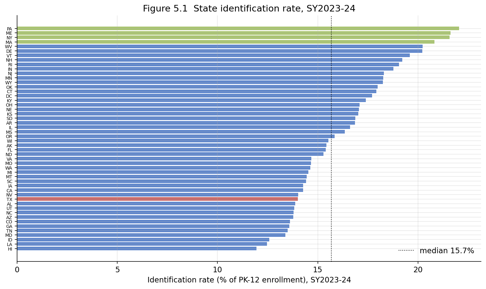
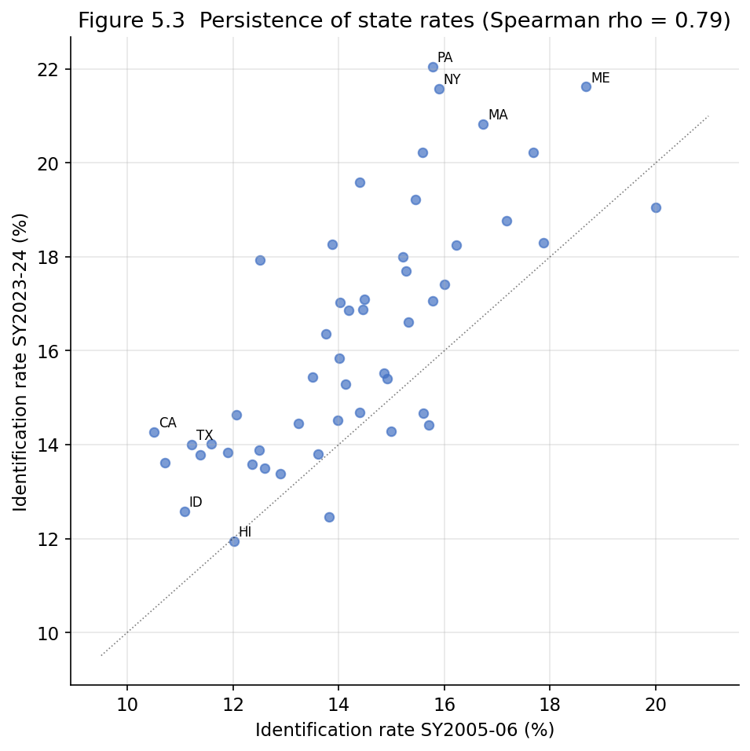
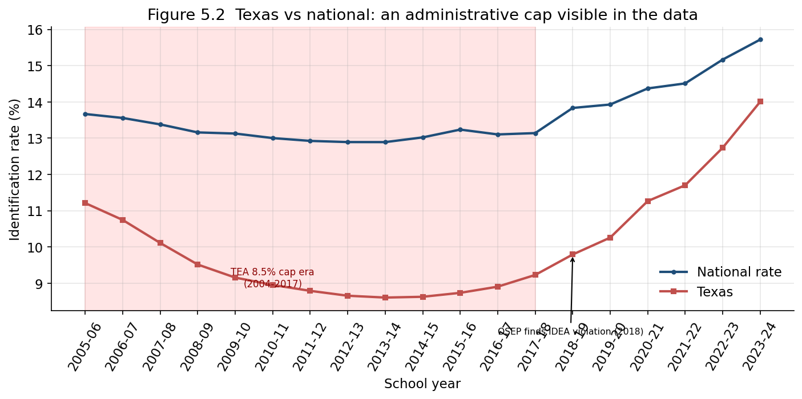

# Chapter 5 — Cross-State Variation in Identification

## 5.1 The same law, fifty-one different rates

IDEA is a federal statute with a single eligibility framework, yet the
share of children identified under it varies almost two-fold across states
in any given year. Chapter 4 found this dispersion for autism specifically;
this chapter examines it for the overall identification rate, where it is
the central object of study rather than a diagnostic aside. The guiding
question is what produces a durable, large gap between states under one
nominally uniform law — and, equally, what this aggregate dataset can and
cannot say about it.

Three cautions inherited from Chapter 1 apply with full force here and are
not repeated after this paragraph. First, the rate is upward-biased
(ages 19–21 and private-school ISP children in the numerator, public PK–12
in the denominator), and **the bias varies by state**, so a raw
state-to-state gap conflates a real difference in identification with a
difference in the bias terms. Second, the two most policy-relevant caveats
in this chapter — the Texas cap and the Wisconsin suppression — are **not**
recorded in the database's `meta_dataquality` ledger; every claim about
them rests on external sources, cited inline. Third, Wisconsin's rate is
NULL for SY2016-17 through SY2019-20 by suppression, so those cells are
simply absent.

## 5.2 The size and shape of the gap

In SY2023-24 the state identification rate ranged from **11.9%** (Hawaii)
to **22.1%** (Pennsylvania), a **1.85-fold** spread, with a median of
15.7%. This matches the official NCES summary, which reports the SY2022-23
range across states as 12% to 21%
([NCES Fast Facts](https://nces.ed.gov/fastfacts/display.asp?id=64)).
Figure 5.1 ranks all states; Table 5.1 lists the extremes.

**Table 5.1 — Identification rate (% of PK-12), SY2023-24, lowest and highest six**

| Lowest six | % | Highest six | % |
|---|---|---|---|
| Hawaii | 11.9 | Pennsylvania | 22.1 |
| Louisiana | 12.5 | Maine | 21.6 |
| Idaho | 12.6 | New York | 21.6 |
| Maryland | 13.4 | Massachusetts | 20.8 |
| Tennessee | 13.5 | West Virginia | 20.2 |
| Georgia | 13.6 | Delaware | 20.2 |

The dispersion is remarkably stable in magnitude. The max/min ratio sits
between 1.85 and 2.07 across the whole window, and the coefficient of
variation barely moves (0.144 in SY2005-06, 0.162 in SY2023-24). Unlike
autism (Chapter 4), where states were converging, the *overall* rate shows
no narrowing: the gap is a fixed structural feature, not a transient.

## 5.3 The gap is persistent, not noise

A two-fold spread could in principle be year-to-year churn — different
states on top each year. It is not. Figure 5.3 plots each state's
SY2005-06 rate against its SY2023-24 rate; the points hug the diagonal, and
the Spearman rank correlation between the two endpoints is

$$
\rho_{\text{2005-06},\,\text{2023-24}} = 0.79 .
$$

A correlation this high across a 19-year gap means the ordering of states
is durable: a state identifying few children in 2005 still identifies few
in 2024. The persistently lowest identifiers are Texas, Idaho, Colorado,
Hawaii, and California; the persistently highest are Maine, Massachusetts,
New York, Pennsylvania, and Rhode Island. Such stability is the signature
of enduring **state-level policy, eligibility interpretation, and
administrative practice** rather than of measurement noise or transient
demographics. The U.S. Government Accountability Office has likewise
attributed the wide interstate range to differences in how states interpret
eligibility criteria, and EdWeek's reporting on the same GAO work notes
that the share of students in special education "varies widely in each
state" for this reason
([EdWeek 2023](https://www.edweek.org/teaching-learning/the-number-of-students-in-special-education-has-doubled-in-the-past-45-years/2023/07)).

## 5.4 Texas: an administrative cap visible in the data

The clearest case of policy driving the rate is Texas, and it is worth
detailing because our data do **not** flag it. Figure 5.2 plots the
Texas rate against the national rate.

Texas entered the window at 11.2% in SY2005-06 — already below the national
13.7% — and then declined steadily to a trough of **8.6%** in SY2013-14 and
SY2014-15, even as the national rate held near 13%. It then reversed
sharply, climbing to 14.0% by SY2023-24. This trajectory is not a
demographic accident. In 2004 the Texas Education Agency adopted an 8.5%
special-education enrollment indicator within its Performance-Based
Monitoring Analysis System, which functioned as a de facto cap: districts
exceeding 8.5% faced monitoring intervention, creating pressure to limit
identification. A 2016 *Houston Chronicle* investigation exposed the
practice ([Texas Observer,
2016](https://www.texasobserver.org/special-education-enrollment-rates-texas/)),
the U.S. Department of Education's Office of Special Education Programs
investigated and in 2018 found that TEA's use of the 8.5% indicator
"contributed to a state-wide pattern of practices" that violated IDEA's
Child Find and FAPE requirements, and the threshold was repealed in 2017
([Morgan, Woods, Wang & Gloski 2023, *Exceptional
Children*](https://journals.sagepub.com/doi/10.1177/00144029221109849);
[Texas Tribune,
2018](https://www.texastribune.org/2018/01/14/school-groups-special-education-texas-legislators/)).

The data trace this policy almost exactly: the decline through the cap era
(shaded), the trough at the cap threshold, and the post-2017 recovery once
the threshold was removed. **But the dataset alone cannot establish the
cause.** The `meta_dataquality` ledger has no `TX_CAP` row (Chapter 1
§1.6); the curve is suggestive, and the attribution to the cap is sound,
but it is sound *because* of the OSEP finding and the peer-reviewed
analysis, not because the data certify it. This is the cleanest
illustration in this study of why a low rate cannot be read as
"appropriate identification" or "under-identification" from the number
alone.

## 5.5 Wisconsin: a hole, not a low

Wisconsin illustrates the opposite hazard — a state that appears to have
*no* rate for four years. Wisconsin's identification rate is NULL for
SY2016-17 through SY2019-20. This is **not** a low identification rate; it
is a suppression of the underlying enrollment denominator in the NCES
source for those years (Chapter 1; NCES Digest 2022 Table 204.70
footnote). Before and after the gap Wisconsin sits near 14–15.5%, an
unremarkable mid-range identifier. A reader scanning Figure 5.1 or a state
panel must not interpret a missing Wisconsin as a zero or a low; the cell
is absent, and — again — the database carries no `SUPPRESSED` caveat row to
say so, so the explanation comes entirely from the NCES documentation.

## 5.6 What the cross-state gap does not establish

The temptation is to read the ranking normatively: high-identifying states
are "over-identifying," low-identifying states are "under-serving." The
dataset does not support either reading, for the reason developed in
Chapter 2 §2.3. The over- versus under-identification question turns on
child-level controls for achievement and socioeconomic status, which this
aggregate panel lacks entirely. Morgan and colleagues, using nationally
representative individual-level data, argued that apparent
over-representation reverses to under-representation once such controls are
applied ([Morgan et al. 2017, *Educational
Researcher*](https://journals.sagepub.com/doi/10.3102/0013189X17726282)) —
and the very same authors' Texas study shows that a *low* rate can be the
product of an illegal cap, i.e. genuine under-service. A high rate and a
low rate can each be either appropriate or pathological; the number does
not say which.

Two further confounds specific to cross-state comparison are worth naming.
The numerator bias (ages 19–21, private-school ISP) differs across states
with different transition-service caseloads and private-school sectors, so
part of the gap in Figure 5.1 is a gap in bias, not in identification.
And states differ in their use of the developmental-delay category and in
age-eligibility windows, shifting children between the counted and
uncounted populations. The dataset can rank states and show the ranking is
durable; it cannot certify that any given state's position reflects the
adequacy of its services.

## 5.7 Summary

The state identification rate varies about 1.85-fold (Hawaii 11.9% to
Pennsylvania 22.1% in SY2023-24), a gap that is stable in magnitude across
19 years and highly persistent in rank (Spearman ρ = 0.79), pointing to
durable state policy and practice rather than noise. Texas is the clearest
case: a decline to an 8.6% trough during the 2004–2017 TEA cap era and a
sharp recovery after the cap's repeal and the 2018 OSEP IDEA-violation
finding — a policy effect plainly visible in the data but attributable
*only* through external sources, since the database carries no cap caveat.
Wisconsin's four NULL years are a denominator suppression, not a low rate,
and likewise undocumented in the ledger. Crucially, the ranking carries no
automatic normative meaning: this aggregate, uncontrolled, state-biased
panel can establish that the gap exists and persists, but cannot judge
whether any state identifies too many or too few children.

Every figure and statistic is reproduced by `chapter5_analysis.ipynb`,
which reads only the assembled dataset (Texas cap dates and the OSEP finding
are external facts, cited above) and writes the three figures referenced.
