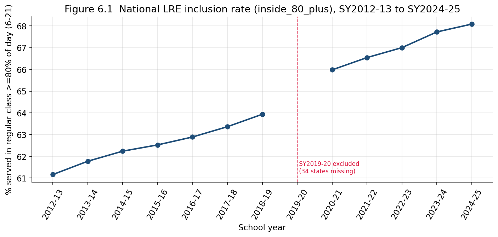
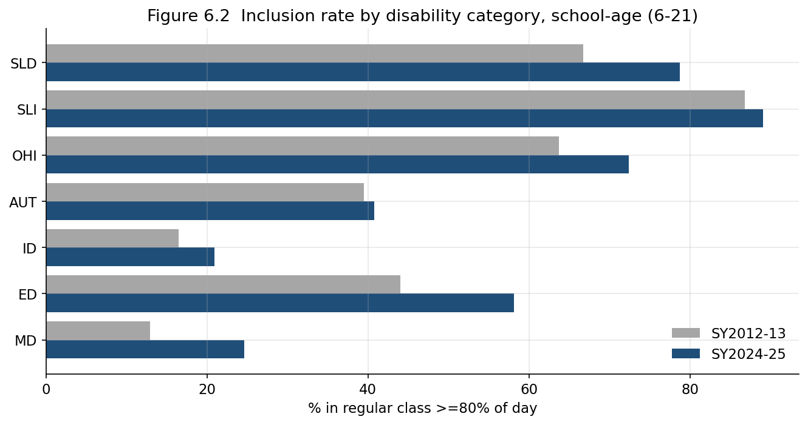
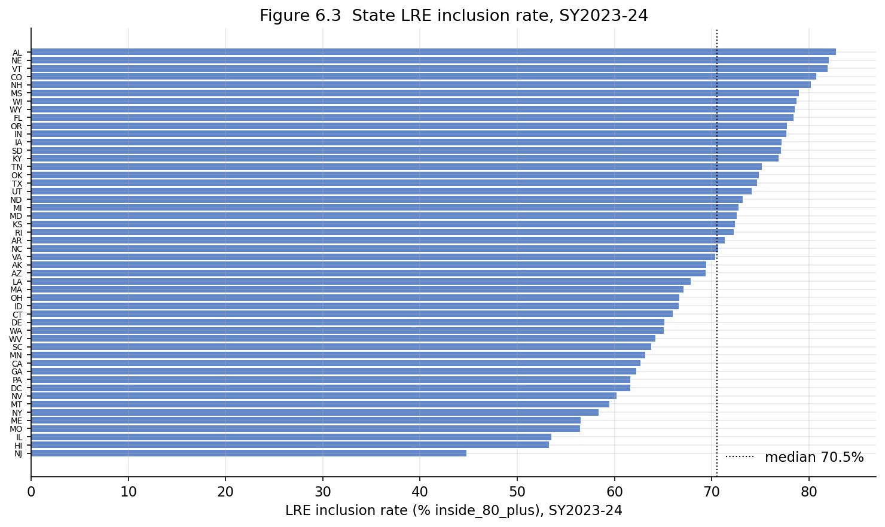

# Chapter 6 — Placement in the Least Restrictive Environment

## 6.1 From "how many" to "where"

The preceding chapters counted children: how many are identified, in which
categories, and where the rate is high or low. This chapter asks a
different question — not how many children are served, but *where* they are
served. IDEA requires that children with disabilities be educated in the
**least restrictive environment** (LRE), alongside non-disabled peers to
the maximum extent appropriate. OSEP's headline LRE indicator is the share
of school-age students served inside the regular classroom for **80% or
more** of the school day. This chapter traces that inclusion rate over
time, across disability categories, and across states.

The scope is narrower than the rest of the study, by construction
(Chapter 1 §1.2). The environment data exist only for **school-age (6–21)**
students and only from **SY2012-13** onward; the early-childhood placement
taxonomy is a different classification and is not comparable. The inclusion
metric is

$$
\text{inclusion}_{80} = 100 \times \frac{n_{\text{inside\_80}}}{n_{\text{total school age}}},
$$

where the denominator is the sum across all nine OSEP placement groups for
`disability_code='ALL'`.

## 6.2 A data defect that must be removed first

Before any trend can be read, one year has to be excluded. In **SY2019-20,
34 of the 51 jurisdictions report no environment data at all** — every
placement cell is NULL, so the inclusion denominator is zero and the rate
is undefined for those states. The 17 states that do report (including
California, Texas, Pennsylvania) reconcile normally, but a national
aggregate that year captures only about a third of the school-age
population. SY2019-20 is the age-5 reclassification transition year
(Chapter 1 issue #15), and the environment dimension was evidently reported
only partially.

The consequence is concrete: a naive enrollment-weighted national inclusion
rate for SY2019-20 computes to roughly 62%, *below* both the year before
(63.9%) and the year after (66.0%), which would look like a dip. **That dip
is an artifact of two-thirds of the denominator being missing, not a real
decline in inclusion.** SY2019-20 is therefore blanked from every figure
and aggregate in this chapter. This defect is not recorded in the
data-quality ledger; we identified it by direct inspection while assembling
the placement data, and we note it here because our initial expectation of
complete coverage across all 51 states and all 13 years does not hold for
the environment data.

## 6.3 The inclusion trend: a steady climb

With SY2019-20 removed, the national inclusion rate rises monotonically
from **61.2%** in SY2012-13 to **68.1%** in SY2024-25 — a gain of about
7 percentage points over twelve reported years, with no reversals.
Figure 6.1 shows it.

The climb is consistent with the long-running policy and advocacy push
toward inclusive placement documented in the special-education literature,
where the 2004 IDEA reauthorization and subsequent practice are credited
with moving services into more inclusive settings ([Penn GSE, *Inclusion
Census*](https://urbanedjournal.gse.upenn.edu/archive/volume-20-issue-1-fall-2022/inclusion-census-how-do-inclusion-rates-american-public-schools)).
One feature deserves caution: the step from SY2018-19 (63.9%) to SY2020-21
(66.0%) straddles the excluded year and the age-5 reclassification. Because
five-year-olds entering the band tend to be served in more inclusive
settings, part of that step reflects a change in *who is counted* rather
than purely a change in placement practice. The pre-2019 and post-2020
segments are each internally clean; the join between them should not be
read as a single-year jump.

## 6.4 Inclusion depends heavily on disability category

The national average hides a wide spread across categories. The same
inclusion metric, computed by disability, ranges from near-universal to
rare. Figure 6.2 and Table 6.1 give the SY2012-13 and SY2024-25 values for
seven categories.

**Table 6.1 — Inclusion rate (% inside regular class ≥80% of day), school-age (6–21)**

| Category | SY2012-13 | SY2024-25 | Change (pp) |
|---|---|---|---|
| SLI — Speech/Language Impairment | 86.8 | 89.1 | +2.3 |
| SLD — Specific Learning Disability | 66.7 | 78.8 | +12.1 |
| OHI — Other Health Impairment | 63.7 | 72.4 | +8.7 |
| ED — Emotional Disturbance | 44.0 | 58.2 | +14.2 |
| AUT — Autism | 39.5 | 40.8 | +1.3 |
| MD — Multiple Disabilities | 12.9 | 24.6 | +11.7 |
| ID — Intellectual Disability | 16.5 | 20.9 | +4.4 |

The category gradient is the central finding. Children with speech/language
impairments are included almost universally (≈89%), and those with learning
disabilities now predominantly (≈79%); children with intellectual or
multiple disabilities are included far less often (21% and 25%). The
gradient tracks the perceived severity and support intensity of each
category, not any single policy lever — which is why a rising *overall*
inclusion rate can coexist with persistently low inclusion for some groups.

Autism is the instructive case when read against Chapter 4. Autism
identification rose more than five-fold, yet its inclusion rate barely
moved (39.5% → 40.8%). The growing autism population is **not** being
absorbed predominantly into regular classrooms; it remains the
second-least-included large category. The composition shift of Chapter 3
therefore has a placement consequence: as autism grows as a share of the
caseload, a category with below-average inclusion grows with it, which
partially offsets the within-category inclusion gains elsewhere and helps
explain why the overall rate rises only gradually.

## 6.5 State variation in inclusion

Inclusion also varies widely across states, independent of how many
children each identifies. In SY2023-24 the state inclusion rate ranged from
**44.8%** (New Jersey) to **82.8%** (Alabama) — a **1.85-fold** spread,
coincidentally the same ratio as the identification-rate gap in Chapter 5,
but across an entirely different dimension. Figure 6.3 ranks the states.

There is no simple relationship between a state's identification rate and
its inclusion rate: a state can identify many children and include them
broadly, or identify few and segregate them, or any combination. The two
gaps — who is identified (Chapter 5) and where they are placed (here) — are
separate policy choices, and the data show states occupying all quadrants.
As with identification, the dataset can document the dispersion but cannot
certify that a high or low inclusion rate is appropriate for a given
state's caseload mix; a state serving a more severe caseload would
mechanically show lower inclusion without any difference in practice.

## 6.6 Limits

Three limits bound this chapter. First, **scope**: school-age only, 12
clean years, no early childhood — the inclusion story for 3–5-year-olds is
simply not in this dataset. Second, **the SY2019-20 hole**: removed here,
but a reminder that the environment fact is less complete than the
disability counts, and that coverage must be checked per year before
aggregating. Third, **no severity adjustment**: the category gradient
(§6.4) and the state gradient (§6.5) both partly reflect differences in
caseload composition rather than placement philosophy, and this aggregate
dataset cannot separate the two. A low inclusion rate for intellectual
disability, or for a state with many severe cases, is not by itself
evidence of insufficiently inclusive practice.

## 6.7 Summary

The school-age LRE inclusion rate rose steadily from 61.2% (SY2012-13) to
68.1% (SY2024-25) once the defective SY2019-20 year — in which 34 states
report no environment data — is removed. Inclusion is strongly
category-dependent: near-universal for speech/language impairment (≈89%),
predominant for learning disabilities (≈79%), but low for intellectual and
multiple disabilities (≈21–25%) and for autism (≈41%). Autism's inclusion
rate barely moved despite its five-fold identification growth, so the
composition shift of Chapter 3 exerts downward pressure on the overall
inclusion trend. States vary 1.85-fold in inclusion (New Jersey 44.8% to
Alabama 82.8%) on a dimension orthogonal to the identification gap of
Chapter 5. Throughout, the dataset documents the gradients but cannot
adjust for caseload severity, so none of these differences can be read
directly as differences in the adequacy of inclusive practice.

Every figure and statistic is reproduced by `chapter6_analysis.ipynb`,
which reads only the assembled dataset and writes the three figures referenced.
