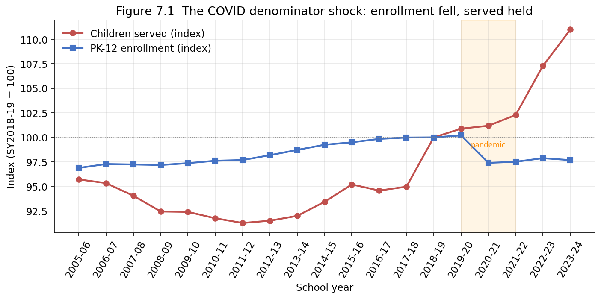
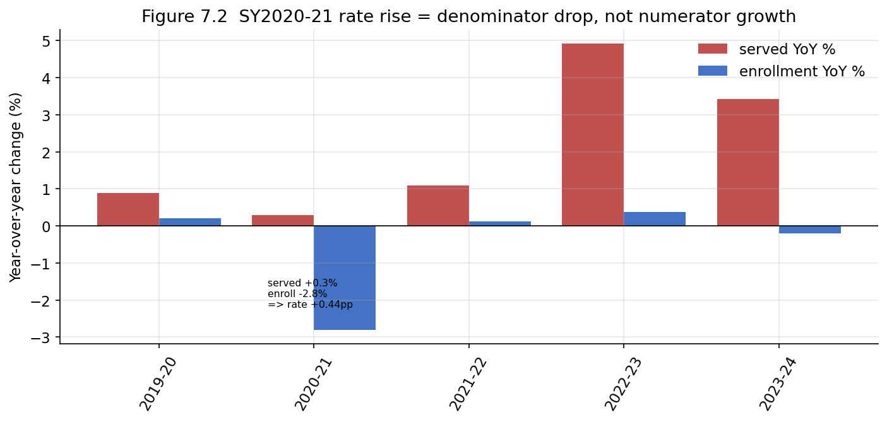

# Chapter 7 — The COVID-19 Inflection

## 7.1 A rate that rose for the wrong reason

The pandemic produced the single most easily misread point in the entire
series. Between SY2019-20 and SY2020-21 the national identification rate
rose from 13.93% to 14.37% — a 0.44-percentage-point jump, one of the
larger single-year moves in the window. Read naively, that looks like a
surge in identification during the pandemic. It is the opposite. This
chapter shows that the SY2020-21 rise is almost entirely a **denominator
shock** — enrollment fell while the served population held flat — and that
beneath the flat national numerator, identification of new cases actually
fell in most states. The pandemic is the cleanest natural test of the
discipline Chapter 1 imposed: report the numerator and denominator
separately, never the rate alone.

## 7.2 Decomposing the SY2020-21 jump

Recall the decomposition from Chapter 2: with $S_t$ children served and
$E_t$ enrolled,

$$
\Delta \ln R_t = \Delta \ln S_t - \Delta \ln E_t .
$$

The components for SY2020-21 are unambiguous:

$$
\Delta S = +0.30％, \qquad \Delta E = -2.80％, \qquad \Delta R = +0.44 \text{pp}.
$$

The served population barely moved; enrollment dropped 2.8% as families
withdrew children, delayed kindergarten entry, or shifted to private and
home settings during the pandemic. The rate rose because its denominator
shrank. Figure 7.1 indexes both series to SY2018-19: in the shaded
pandemic window the enrollment line falls sharply while the served line
stays essentially flat.

Figure 7.2 makes the contributions explicit, plotting the year-over-year
change in each component. SY2020-21 is the only year in which a near-zero
numerator change combines with a sharp negative denominator change — the
mechanical signature of a rate rise caused by denominator loss.

This matches the official record exactly. NCES reported that total public
enrollment fell about 3% from fall 2019 to fall 2020 while the number of
students served under IDEA fell about 1% — the first decline in the served
count in a decade — yet the *percentage* served "continued its upward
trend"
([NCES Fast Facts](https://nces.ed.gov/fastfacts/display.asp?id=64)). The
rate went up because the denominator went down.

## 7.3 The flat numerator hides a real decline in identification

The national served count's +0.30% change is itself misleading, in a way
that only disaggregation reveals. **In 34 of the 51 jurisdictions the
served count actually fell** between SY2019-20 and SY2020-21; the flat
national total is held up by growth in a few large states. More
importantly, a flat *stock* of served children is consistent with a sharp
drop in the *flow* of new identifications, because the stock is dominated
by continuing cases. The mechanism is well documented: the referral and
evaluation pipeline — pre-referral intervention, response-to-intervention
monitoring, in-person observation, and assessment — largely broke down
under remote learning, so children who would normally have been newly
identified were not.

The peer-reviewed evidence is striking and consistent across states. A
study of 2.9 million Michigan students found that new special-education
identifications fell **19% in 2019-20 and 12% in 2020-21**, with the
steepest declines in fully remote districts and among Black, Asian, and
economically disadvantaged students; rates returned to trend only in
2021-22 ([Hopkins, Guzman, Imberman, Truckenmiller, Strunk & Fisher 2025,
*Educational Evaluation and Policy
Analysis*](https://journals.sagepub.com/doi/10.3102/01623737241274799);
[NBER w31261](https://www.nber.org/system/files/working_papers/w31261/w31261.pdf)).
A parallel CALDER study of Washington elementary students estimated that
over **8,000 fewer students** were identified than prior trends would
predict, with identification "plummeting" when schools closed in
March 2020 ([CALDER
Center](https://caldercenter.org/publications/special-education-identification-throughout-covid-19-pandemic);
[EdWeek 2024](https://www.edweek.org/teaching-learning/schools-lag-in-iding-kids-who-need-special-education-are-they-catching-up/2024/12)).
Specific learning disability — the category whose identification depends
most on the academic-progress monitoring that remote learning disrupted —
was the most affected, consistent with this dataset's own SLD school-age
count falling 2.3% that year (Table 7.1).

**Table 7.1 — School-age (6–21) category count change, SY2019-20 → SY2020-21**

| Category | Change | Note |
|---|---|---|
| DD — Developmental Delay | +43.7% | confounded with age-5 reclass |
| SLI — Speech/Language Impairment | +13.3% | confounded with age-5 reclass |
| AUT — Autism | +9.1% | continuing trend |
| OHI — Other Health Impairment | +2.2% | continuing trend |
| ED — Emotional Disturbance | +0.1% | flat |
| ID — Intellectual Disability | −1.7% | decline |
| MD — Multiple Disabilities | −1.9% | decline |
| SLD — Specific Learning Disability | −2.3% | decline (RTI pipeline disrupted) |

## 7.4 A measurement trap inside the pandemic year

Table 7.1 contains its own warning. The two largest *increases* — DD
(+43.7%) and SLI (+13.3%) — are **not** pandemic effects at all. SY2020-21
is the year school-age five-year-olds entered the 6–21 band (the age-5
reclassification, Chapter 1 issue #15), and five-year-olds are
disproportionately served under developmental-delay and speech/language
labels. Those two jumps are a definitional change in who is counted,
overlaid on the pandemic, and must not be read as a COVID-era rise in
identification. The genuine COVID signal is in the *declining* categories —
SLD, ID, MD — and in the broken referral pipeline behind them. This is a
textbook case of two seams coinciding: a real shock (COVID) and a
definitional change (age-5 reclass) land in the same year, and only
category-level disaggregation separates them.

## 7.5 What came after: catch-up and a genuine resumption

The pandemic distortion was temporary. From SY2021-22 the served count
resumes real growth — +1.1%, then +4.9% in SY2022-23 and +3.4% in
SY2023-24 — well above the flat pandemic years, while enrollment stabilizes.
The post-2021 rate rise (to 15.72% by SY2023-24) is therefore a *genuine*
numerator-driven increase, unlike the SY2020-21 step. Part of the
post-pandemic acceleration likely reflects "catch-up" identification of
children whose evaluations were deferred, though the research cautions that
catch-up has not fully closed the pandemic deficit and some children who
would have been identified may simply have been missed ([CALDER /
EdWeek](https://www.edweek.org/teaching-learning/impact-of-missed-special-ed-evaluations-could-echo-for-years/2024/06)).
This dataset cannot distinguish catch-up from new identification — it has
no flow data, only annual stocks — so it can show the resumption but not
attribute it.

## 7.6 The caveat the data do not carry

As with the Texas cap and Wisconsin suppression (Chapter 5), the pandemic
is **not** flagged in the data-quality ledger. A COVID caveat for
SY2020-21 was among the issues we contemplated, but the assembled dataset
does not encode it. Every claim in this chapter about the pandemic's
mechanism therefore rests on the decomposition (internal to the data) plus
external sources (NCES, the Michigan and Washington studies); the database
documents neither the enrollment shock nor the identification-pipeline
disruption as a caveat. An analyst working only from the rate column, with
no external knowledge, would see a rate that rose smoothly through 2020 and
would have no internal signal that the SY2020-21 point means something
categorically different from its neighbors.

## 7.7 Summary

The SY2020-21 identification-rate rise (13.93% → 14.37%, +0.44 pp) is a
denominator artifact: the served population grew only 0.30% while
enrollment fell 2.80%. Beneath the flat national numerator, served counts
fell in 34 of 51 states, and peer-reviewed work shows new identifications
dropped 12–19% as the referral-and-evaluation pipeline broke down under
remote learning, hitting SLD hardest — visible here as a 2.3% SLD decline.
Two of the year's largest category increases (DD, SLI) are the age-5
reclassification, not COVID, and only disaggregation separates the two
coinciding seams. Identification resumed genuine growth from SY2021-22,
partly as deferred-evaluation catch-up, but this stock-only dataset cannot
distinguish catch-up from new flow. And like the other policy shocks in
this study, the pandemic leaves no caveat in the data-quality ledger —
the interpretation is supplied entirely by the decomposition and by
external evidence.

Every figure and statistic is reproduced by `chapter7_analysis.ipynb`,
which reads only the assembled dataset and writes the two figures referenced.
